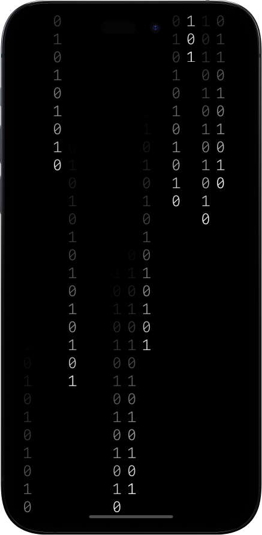

# 🌧️ Binary rain effect

Binary rain effect with swift programming language, using SwiftUI.

### <b>Built with</b>

### <b>Screenshots</b>

### <b>Run the project</b>

🔗 Run the project
[here](https://www.instagram.com/reel/Co13D6lg3gu/)

